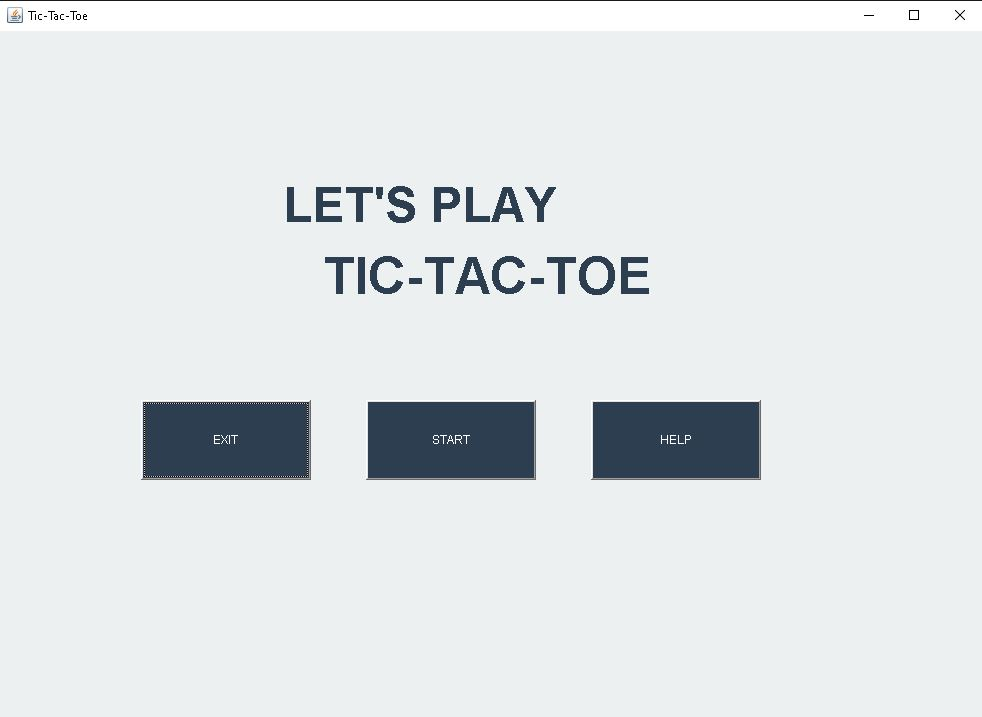
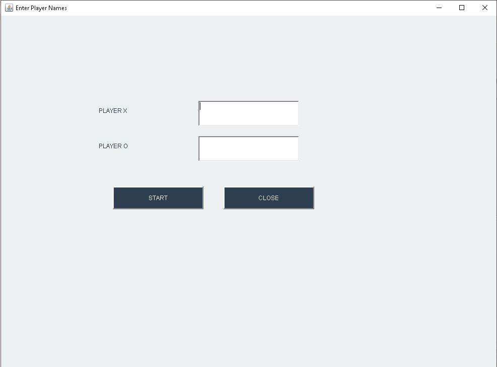
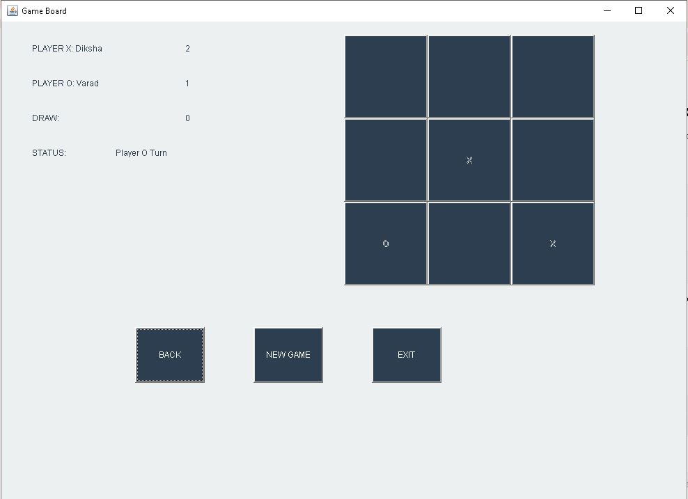
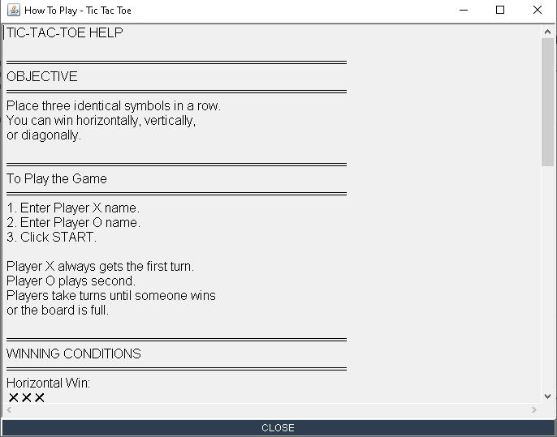

# 🎮 Tic-Tac-Toe Game 

## 📖 About the Project

Welcome to my first Java project!

This Tic-Tac-Toe game is the first complete application I developed while learning Java programming. Through this project, I explored Java AWT, graphical user interface (GUI) development, event handling, and object-oriented programming concepts. Developing this project helped me understand how to design an interactive desktop application and improve my problem-solving skills.

The game is designed for **Player vs Player** mode, allowing two players to enjoy a classic Tic-Tac-Toe game through a simple and user-friendly graphical interface.

---

## ✨ Features

- 🎮 Player vs Player gameplay
- 👤 Players can enter their names before starting the game
- 🏆 Automatic winner detection
- 🤝 Draw detection
- 📖 Help section explaining how to play the game
- 🔄 New Game option to start another match
- ❌ Exit option to close the application
- 🖥️ Interactive graphical user interface built using Java AWT

---

## 🖼️ Application Windows

### 1. Main Window
- Displays the project title.
- Provides options to start the game,view the Help section and to exit the game.

### 2. Player Details Window
- Allows both players to enter their names before starting the match.

### 3. Game Window
- Displays the 3×3 Tic-Tac-Toe board.
- Handles player turns.
- Detects the winner or draw automatically.
- Allows players to start a new game or exit the application.

### Help Window
The Help window can be opened from the Main Window by clicking the **Help** button. It provides instructions for playing the game.

---

## 📸 Screenshots

### Main Window



---

### Player Details Window



---

### Game Window



---

### Help Window



---

## 🛠️ Technologies Used

- Java
- Java AWT
- Event Handling
- Object-Oriented Programming (OOP)

---

## 📂 Project Structure

```text
tic-tac-toe-java/
│
├── chk_fix.java
├── README.md
├── main-window.png
├── player-window.png
├── game-window.png
└── help-window.png
```

## ▶️ How to Run the Project

1. Download or clone the repository.
2. Open the project in your Java IDE or VS Code.
3. Compile the Java file.

```bash
javac chk_fix.java
```

4. Run the program.

```bash
java chk_fix
```

---

## 📚 What I Learned

While building this project, I learned:

- Java AWT GUI development
- Event handling using ActionListener
- Object-Oriented Programming concepts
- Working with multiple windows (Frames)
- Java application design
- Debugging and testing Java applications

This project marks the beginning of my journey in Java application development, and it has motivated me to continue building more real-world projects.

---

## 🚀 Future Improvements

Some features that can be added in future versions include:

- Player vs Computer mode
- Score history
- Game statistics
- Improved UI and animations
- Database integration for saving previous matches
- Sound effects

---

## 👩‍💻 Author

**Diksha Shukla**

This is my **first Java GUI project**, developed as a part of my learning journey in Java programming. I look forward to building more projects and continuously improving my software development skills.

⭐ Thank you for visiting my project!
